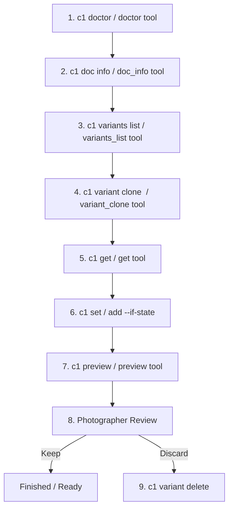

# AGENTS.md — Instructions for AI Coding & Reasoning Agents

This file provides rules, architectural constraints, and standard operating procedures for autonomous or interactive agents (Claude Code, Cursor, Windsurf, Codex, etc.) utilizing `c1` via the CLI or the MCP server (`c1-mcp`).

---

## 1. Core Principles & Non-Negotiable Safety Rules

1. **Originals Are Immutable:**
   - You **cannot** mutate original variants or native variant IDs directly. Attempting to do so will be rejected with an `unmanaged-variant` error.
   - All mutations (`set`, `add`, `reset`) must target a **managed working reference** (`c1_wrk_<uuid>`).
   - Create a managed working reference by cloning the source variant first: `c1 variant clone <source-id>`.

2. **Sessions vs. Catalogs:**
   - Catalogs are strictly **read-only**. Any mutation verb on a Catalog fails closed with an `invalid-request` error.
   - For editing workflows, ensure a Session (`.cosessiondb`) is active.

3. **Optimistic Concurrency Is Mandatory:**
   - Every mutation command requires a state precondition: `--if-state <hash>` (or `ifState` in MCP).
   - Obtain the current `stateHash` using `c1 get <working-ref>` immediately before calculating and applying adjustments.
   - If a mutation fails with `state-changed`, re-read the variant state with `get`, reconcile differences, and retry with the updated state hash.

4. **Never Guess or Retry Blindly on Failure/Timeout:**
   - If an operation times out or returns `outcome-unknown`, Capture One may still be executing the Apple Event.
   - Do **not** issue duplicate mutations. Check the status using `c1 operation status <operationId>` or inspect `.c1/journal.jsonl`.

---

## 2. Canonical Grading Workflow

Always follow this sequence when automating adjustments or grading a shoot:

1. **Health Check:** Run `c1 doctor` (or `doctor` tool in MCP). Confirm `allChecksPassed: true` and `isSession: true`.
2. **Context Discovery:** Run `c1 doc info` and `c1 variants list` to discover available image files and variant IDs.
3. **Isolate Changes:** Run `c1 variant clone <sourceId>` (e.g. `c1 variant clone 1`). Record the returned `workingRef` (e.g. `c1_wrk_...`) and initial `baselineStateHash`.
4. **Inspect State:** Run `c1 get <workingRef>`. Inspect adjustments, capture metadata, and note `stateHash`.
5. **Apply Adjustments:**
   - Use `c1 set <workingRef> --if-state <stateHash> [key=value...]` for absolute targets.
   - Use `c1 add <workingRef> --if-state <stateHash> [key=value...]` for relative deltas.
   - Read the returned `diff`, `after`, and updated `stateHash`.
6. **Visual Verification:** Run `c1 preview <workingRef>` (or `preview` tool in MCP). In MCP, this returns both image metadata and a base64 `image/jpeg` visual content block for inspection.
7. **Compare Changes:** Run `c1 diff <workingRef>` to inspect adjustments against the baseline.
8. **Rejection / Cleanup:** If the proposal is rejected by the photographer or fails visual inspection, cleanly remove the proposal with `c1 variant delete <workingRef>`. Never attempt to delete original variants.

---

## 3. Supported Adjustment Fields & Valid Ranges

Do not attempt to set fields outside this table:

| Parameter | Aliases | Minimum | Maximum | Unit | Description |
|---|---|---|---|---|---|
| `exposure` | `exp` | `-4.0` | `+4.0` | EV | Exposure compensation |
| `contrast` | - | `-50.0` | `+50.0` | Int/Float | Contrast adjustment |
| `saturation` | `sat` | `-100.0` | `+100.0` | Int/Float | Saturation adjustment |
| `temperature` | `kelvin`, `temp` | `800.0` | `14000.0` | Kelvin | White balance Kelvin |
| `tint` | - | `-50.0` | `+50.0` | Float | White balance tint |

> **White Balance Note:** `temperature` and `tint` are coupled in Capture One. Whenever modifying white balance, always inspect both values after the write.

---

## 4. MCP Server Usage Notes

When using `c1-mcp`:
- All tools take a JSON object matching their declared schema.
- Top-level adjustment keys can be passed either flat (e.g., `{"workingRef": "...", "ifState": "...", "exposure": 0.3}`) or grouped under an `adjustments` object.
- The `preview` tool returns a standard MCP image content block (`image/jpeg`) which renders directly in supporting LLM interfaces.

---

## 5. Error Code Reference

- `app-not-running`: Launch Capture One and ensure GUI is active.
- `no-document`: Open a Session in Capture One.
- `unsupported-version`: Capture One build does not match pinned build (`16.8.5.30`).
- `unmanaged-variant`: Attempted mutation on an unmanaged original; clone first.
- `capture-one-busy`: Cross-process advisory lock timed out; wait or check for hung processes.
- `document-changed`: The active Session was closed or replaced during execution.
- `state-changed`: Optimistic concurrency check failed (`--if-state` mismatch).
- `readback-mismatch`: Capture One returned values outside tolerance.
- `permission-denied`: Automation permission missing in macOS System Settings.
